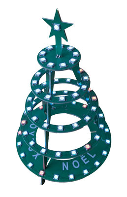

# Sapin lumineux noel 2025

Caractéristiques matérielles :

Microcontrôleur : ESP32-C3 Super Mini (1 cœur RISC-V, 4Mo Flash, Wifi, Bluetooth)

Alimentation et liaison série de communication par la connexion USB (le Driver USB/Série CH340 est intégré à Windows 11)

Liste des entrées/sorties
* N°7 : Sortie numérique vers 77 LEDs de type WS2812B
* N°8 : Sortie numérique vers LED bleue sur le module ESP32-C3
* N°21 : Entrée numérique du bouton LUM (niveau ‘1’ lorsque le bouton est appuyé)
* N°0 : Entrée numérique du bouton MODE (niveau ‘1’ lorsque le bouton est appuyé)
* N°A1 : Entrée analogique du capteur de luminosité

# Environnement de développement Arduino
Arduino, programmation en langage C
* Installer [Arduino IDE](https://www.arduino.cc/en/software/)
* Installer la librairie de carte ESP32 : ESP32 3.3.0 by Espressif
* Installer la librairie de gestion des LED multicolore : Adafruit_NeoPixel V1.15.1
* Connecter le sapin avec un cordon USB
* Sélectionner la carte « ESP32C3 Dev Module »
* Sélectionner le port série
* Sélectionner USB CDC On Boot « Enabled » et JTAG Adapter « Integrated USB JTAG » pour utiliser la console de debug avec le port série @115200Bds.

Le code source (fichier sapin_2025_arduino.ino) est disponible dans ce dépôt GIT.

Pour information, le programme fourni occupe 24% de la mémoire flash.

# Environnement de développement MicroPython
Micropython, programmation en langage Python
* Installer Python
* Installer la librairie esptool « pip install esptool »
* Installer [Thonny IDE](https://thonny.org/)
* Installer micropyton : menu tools / options / interpreter / install micropython
  - Connecter le sapin avec un cordon USB
  - Sélectionner le port série
  - Sélectionner le type de carte : ESP32, puis ESP32-C3
  - Sélectionner la version micropython : 1.26.1
* Charger le fichier source qui doit s’appeler main.py à la racine du module ESP32.

Un fichier exemple (fichier main.py) est disponible dans ce dépôt GIT.

